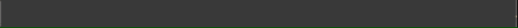

# news-ticker


a small news-ticker scroll bar for browser



English | [简体中文](./README.zh-cn.md)

[Demo on Codepan](https://codepan.net/gist/2cd3af9c900a4fce989b0440a26ad434)

## Syntax
```js
const ntInst = new NewsTicker({
  el: document.querySelector('.bar'),
  // element to contain the news ticker

  textArr: [],
  // OPTIONAL, string to be shown in news ticker

  speed: 2,
  // OPTIONAL, number of scrolling speed, in `px`

  onLeave: () => {}
  // OPTIONAL, function to be trigger when some text scroll out of the screen
})

ntInst.add('d')
ntInst.add(['e', 'f'])
// push some string to the end of Queue
```

## How to use
### install
`yarn add news-ticker` or  
[](https://nodei.co/npm/news-ticker/)


### import
```javascript
import NewsTicker from 'news-ticker'
```

### use it
```javascript
const nt = new NewsTicker({
  el: $('.line')
})
nt.add('hello world')
```

### css
```
.line {
  background: #282828
}
.line div {
  color: #FFC324;
  line-height: 28px;
  height: 28px;
}
```

## License
MIT

## Dev
1. install all the dev dependencies: `yarn`
2. dev: `yarn dev`
3. package: `yarn build`

## contributing
1. Fork this repo
2. Create your feature branch: `git checkout -b MY-NEW-FEATURE`
3. Commit your changes: `git commit -am 'ADD SOME FEATURE'`
4. Push to the branch: `git push origin MY-NEW-FEATURE`
5. Submit a pull request :D
